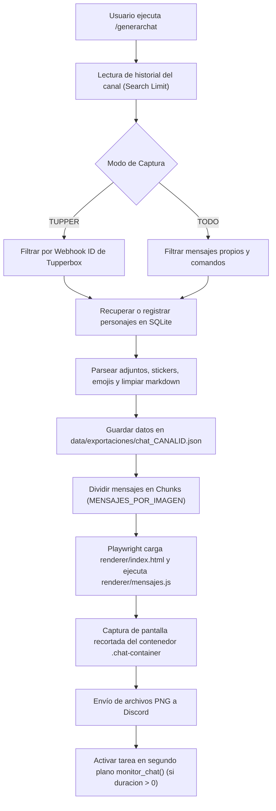

# 🤖 EriduBot - Renderizador y Exportador Visual de Chats de Discord

**EriduBot** es un bot avanzado de Discord diseñado para capturar, almacenar y renderizar conversaciones de texto en elegantes imágenes estilo mensajería/novela visual. Está especialmente optimizado para servidores de rol que utilizan **Tupperbox**, así como para chats convencionales de usuarios.

El bot transforma los mensajes de Discord en una interfaz web personalizada (HTML/CSS/JS) y genera capturas PNG de alta calidad sin fondo mediante un navegador headless (**Playwright / Chromium**), dividiendo automáticamente conversaciones largas en imágenes segmentadas y permitiendo el monitoreo en tiempo real del canal.

---

## 🌟 Características Principales

- 📸 **Renderizado Web de Alta Calidad**:
  - Utiliza **Playwright (Chromium Headless)** con escala de dispositivo `2x` para producir capturas nítidas y limpias.
  - Recorte automático exacto del contenedor de chat (`.chat-container`) sin espacios sobrantes ni fondos no deseados.
  - Tipografía personalizada integrada (*HongMengTi*).

- 🎭 **Modos de Captura Flexibles**:
  - **Modo Tupperbox (`TUPPER`)**: Detecta automáticamente el Webhook de Tupperbox en el servidor analizando el historial y filtra únicamente los mensajes emitidos por personajes.
  - **Modo General (`TODO`)**: Captura las intervenciones de todos los usuarios y bots (excluyendo comandos y mensajes del propio bot).

- 🧩 **Segmentación Inteligente por Lotes**:
  - Divide conversaciones extensas en imágenes secuenciales (partes) según el límite configurado (`MENSAJES_POR_IMAGEN`), evitando imágenes desproporcionadamente largas o fallos por límites de tamaño en Discord.

- 🔄 **Monitoreo Dinámico en Tiempo Real**:
  - Comando `/generarchat` con parámetro de duración (minutos) que inicia un monitor en segundo plano.
  - Cada minuto verifica si se han enviado nuevos mensajes al canal y actualiza el mensaje de Discord con las imágenes regeneradas.
  - Prevención automática de conflictos de monitores concurrentes por canal.

- 🎨 **Personalización Visual Interactiva**:
  - **Asignación de Lado**: Botones interactivos (`LadoView`) en Discord para definir si un personaje habla desde la izquierda o la derecha.
  - **Editor de Personajes (`/editarpersonaje`)**: Interfaz interactiva por DM o canal (`EditPersonajeView`) con previsualización en tiempo real. Permite alternar lado y cambiar el color de fondo y color de texto mediante ventanas modales (`ColorModal`) con códigos HEX (`#RRGGBB`).

- 📎 **Soporte Multimedia y Enriquecido**:
  - **Emojis de Discord**: Transforma emojis personalizados (`<:nombre:id>` y `<a:nombre:id>`) en imágenes en línea dentro de las burbujas.
  - **Adjuntos e Imágenes**: Renderiza fotos, imágenes incrustadas y enlaces GIF (Tenor/Giphy).
  - **Stickers**: Soporte para stickers de Discord (PNG/APNG).
  - **Archivos Descargables**: Presentación de archivos (PDF, ZIP, etc.) en tarjetas visuales con enlaces de descarga.
  - **Limpieza de Formato**: Limpieza de sintaxis Markdown de Discord (bloques de código, negrita, cursiva, tachado, spoilers).

- ⚡ **Herramientas de Moderación/Utilidad**:
  - Comando `/spam_ping` con control de intervalo asíncrono (1.5s por mensaje) y validación de seguridad (hasta 30,000 menciones) para evitar bloqueos por *Rate Limit* de la API de Discord.
  - Decorador `@requiere_admin()` que restringe comandos críticos al rol administrativo definido.

---

## 📂 Estructura del Proyecto

```plaintext
BotDiscord/
├── bot.py                  # Archivo principal: comandos slash, ciclo de eventos y monitor
├── requirements.txt        # Dependencias de Python requeridas
├── .env.example            # Plantilla de variables de entorno
├── .gitignore              # Archivos y carpetas ignorados por git
├── README.md               # Documentación general del proyecto
│
├── core/
│   ├── __init__.py
│   └── database.py         # Conexión asíncrona a SQLite (aiosqlite) y queries
│
├── renderer/
│   ├── __init__.py
│   ├── captura.py          # Automatización de Playwright para renderizar HTML a PNG
│   ├── index.html          # Plantilla HTML base del chat
│   ├── mensajes.js         # Lógica JavaScript para inyectar burbujas y adjuntos
│   ├── styles.css          # Estilos CSS de las burbujas, avatares y contenedor
│   └── fuentes/            # Fuentes tipográficas (印品鸿蒙体.ttf)
│
├── ui/
│   ├── __init__.py
│   └── views.py            # Componentes interactivos de Discord (Views, Buttons, Modals)
│
├── data/
│   ├── eridubot.sqlite     # Base de datos SQLite local
│   └── exportaciones/      # Almacén de JSONs de conversaciones e imágenes temporales
│
└── TestHTML/               # Pruebas y bocetos de maquetación HTML/CSS
    ├── TextBoxAzul.html
    ├── TextBoxGris.html
    └── index.html
```

---

## 🛠️ Tecnologías y Librerías

- **Lenguaje**: [Python 3.11+](https://www.python.org/)
- **Biblioteca de Discord**: [discord.py](https://discordpy.readthedocs.io/) (v2.3+) con soporte para `app_commands` (Slash Commands) y Discord UI Components.
- **Motor de Renderizado**: [Playwright para Python](https://playwright.dev/python/) ejecutando Chromium Headless.
- **Base de Datos**: [aiosqlite](https://github.com/omnilib/aiosqlite) para operaciones asíncronas con SQLite.
- **Variables de Entorno**: [python-dotenv](https://github.com/theskumar/python-dotenv).
- **Frontend del Renderizador**: HTML5, CSS3 moderno (Flexbox, gradientes, clip-path) y JavaScript Vanilla ES6.

---

## 🚀 Instalación y Puesta en Marcha

### 1. Prerrequisitos
- Python 3.11 o superior instalado en el sistema.
- Git instalado (opcional, para clonar y control de versiones).

### 2. Clonar el Repositorio
```bash
git clone https://github.com/tu-usuario/BotDiscord.git
cd BotDiscord
```

### 3. Crear y Activar un Entorno Virtual
En Windows (PowerShell):
```powershell
python -m venv venv
.\venv\Scripts\Activate.ps1
```

En Linux/macOS:
```bash
python3 -m venv venv
source venv/bin/activate
```

### 4. Instalar Dependencias de Python
```bash
pip install -r requirements.txt
```

### 5. Instalar los Binarios del Navegador para Playwright
Playwright requiere descargar Chromium para realizar las capturas:
```bash
playwright install chromium
```

### 6. Configurar las Variables de Entorno
Copia el archivo `.env.example` a un nuevo archivo `.env`:
```bash
copy .env.example .env   # En Windows
cp .env.example .env     # En Linux/macOS
```

Edita el archivo `.env` con tus credenciales (ver la siguiente sección).

### 7. Iniciar el Bot
```bash
python bot.py
```
Al iniciar, el bot creará automáticamente las tablas SQLite en `data/eridubot.sqlite` si no existen y sincronizará los comandos Slash con Discord (`tree.sync()`).

---

## ⚙️ Variables de Entorno (`.env`)

| Variable | Tipo | Descripción | Valor por Defecto / Ejemplo |
| :--- | :--- | :--- | :--- |
| `DISCORD_TOKEN` | String | Token de autenticación del bot de Discord. | *(Requerido)* |
| `TUPPER_WEBHOOK_ID` | String / Int | ID por defecto del webhook de Tupperbox. | *(Opcional, autodetectable)* |
| `ROL_ADMIN` | String | Nombre del rol en Discord necesario para usar comandos de administración. | `"Bot Admin"` |
| `EXPORT_FOLDER` | String | Carpeta donde se guardan JSONs de sesión e imágenes generadas. | `"data/exportaciones"` |
| `MAX_MENSAJES_TOTAL` | Integer | Límite máximo de mensajes permitidos al solicitar una captura. | `50` |
| `MENSAJES_POR_IMAGEN` | Integer | Cantidad de mensajes agrupados por cada captura/imagen segmentada. | `10` |
| `SEARCH_LIMIT` | Integer | Profundidad de búsqueda de mensajes en el historial del canal. | `500` |

---

## ⌨️ Comandos Slash

Todos los comandos administrativos requieren que el usuario tenga el rol configurado en `ROL_ADMIN`.

| Comando | Permisos | Parámetros | Descripción |
| :--- | :--- | :--- | :--- |
| `/generarchat` | Admin | `cantidad` *(int, opc)*: Cantidad total de mensajes.<br>`title` *(str, opc)*: Título mostrado en la cabecera.<br>`duracion` *(int, opc)*: Minutos de monitorización activa. | Genera la conversación en una o varias imágenes segmentadas e inicia el monitor en tiempo real. |
| `/forzaractualizacion` | Admin | *Ninguno* | Comprueba y fuerza la actualización manual de la imagen en el mensaje generado previamente. |
| `/listarmonitores` | Admin | *Ninguno* | Lista todos los canales que tienen un monitor de auto-actualización activo y el tiempo restante. |
| `/detenermonitor` | Admin | *Ninguno* | Detiene y cancela inmediatamente el monitor activo en el canal actual. |
| `/editarpersonaje` | Admin | `nombre` *(str, req)*: Nombre del personaje en la base de datos. | Abre un menú interactivo con vista previa para personalizar el lado (izq/der), color de fondo y color de texto. |
| `/configuracion` | Admin | `modo` *(choice, req)*:<br>• `TUPPER`: Solo mensajes de Tupperbox.<br>• `TODO`: Todos los mensajes del chat. | Define el modo de captura para el servidor actual. |
| `/spam_ping` | Público | `usuario` *(Member, req)*: Usuario a mencionar.<br>`cantidad` *(int, req)*: Número de pings (máx. 30,000). | Envía menciones continuas al usuario con pausas de 1.5s para no saturar los límites de la API de Discord. |

---

## 🔄 Flujo de Funcionamiento del Renderizado



---

## 🗄️ Esquema de la Base de Datos SQLite

La base de datos se almacena en `data/eridubot.sqlite` con las siguientes tablas:

### 1. `Personaje_Tabla`
Almacena la configuración visual de cada personaje o usuario:
- `tupper_tag` (`TEXT PRIMARY KEY`): Identificador único o etiqueta sanitizada.
- `nombre` (`TEXT NOT NULL`): Nombre para mostrar del personaje.
- `lado` (`TEXT NOT NULL`): `"I"` para Izquierda o `"D"` para Derecha.
- `avatar_url` (`TEXT`): URL del avatar del personaje.
- `color` (`TEXT DEFAULT '#FFFFFF'`): Color de fondo de la burbuja (HEX).
- `color_texto` (`TEXT DEFAULT '#000000'`): Color de la fuente del mensaje (HEX).

### 2. `Tupperbox_Webhooks`
Caché de IDs de webhook asociados a Tupperbox por servidor:
- `guild_id` (`TEXT PRIMARY KEY`): ID del servidor de Discord.
- `webhook_id` (`TEXT NOT NULL`): ID del webhook detectado.

### 3. `Guild_Config`
Configuraciones específicas de cada servidor:
- `guild_id` (`TEXT PRIMARY KEY`): ID del servidor de Discord.
- `modo_captura` (`TEXT DEFAULT 'TUPPER'`): Modo de captura (`'TUPPER'` o `'TODO'`).

---

## 🛡️ Seguridad y Buenas Prácticas

1. **Protección del Token**: Nunca subas el archivo `.env` a repositorios públicos. El archivo `.gitignore` ya está configurado para excluirlo.
2. **Rate Limits de Discord**: Los bucles de mensajes continuos (como `/spam_ping`) incorporan llamadas a `asyncio.sleep(1.5)` para respetar las cuotas de la API de Discord y prevenir bloqueos temporales por HTTP 429.
3. **Limpieza de Archivos Temporales**: Las imágenes generadas localmente se eliminan de disco una vez enviadas a Discord para evitar saturar el almacenamiento.
