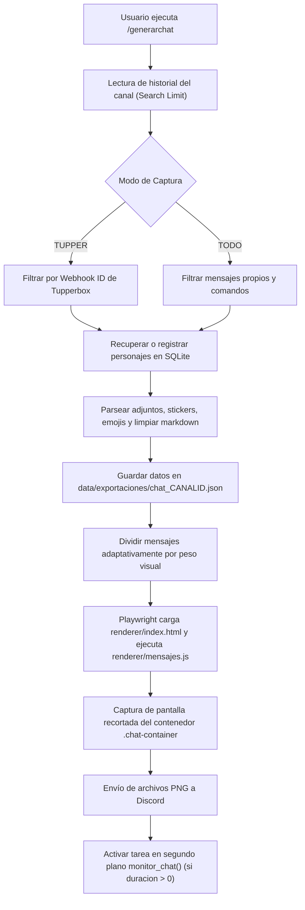

# 🤖 EriduBot - Renderizador y Exportador Visual de Chats de Discord

**EriduBot** es un bot avanzado de Discord diseñado para capturar, almacenar y renderizar conversaciones de texto en elegantes imágenes estilo mensajería/novela visual. Está especialmente optimizado para servidores de rol que utilizan **Tupperbox**, así como para chats convencionales de usuarios.

El bot transforma los mensajes de Discord en una interfaz web personalizada (HTML/CSS/JS) y genera capturas PNG de alta calidad sin fondo mediante un navegador headless (**Playwright / Chromium**), dividiendo automáticamente conversaciones largas en imágenes segmentadas y permitiendo el monitoreo en tiempo real del canal.

---

## 🌟 Características Principales

- 📸 **Renderizado Web de Alta Calidad**:
  - Utiliza **Playwright (Chromium Headless)** con escala de dispositivo `2x` para producir capturas nítidas y limpias.
  - Recorte automático exacto del contenedor de chat (`.chat-container`) sin espacios sobrantes ni fondos no deseados.
  - Tipografía personalizada integrada (*HongMengTi*).

- 🎭 **Modos de Captura Flexibles**:
  - **Modo Tupperbox (`TUPPER`)**: Detecta automáticamente el Webhook de Tupperbox en el servidor analizando el historial y filtra únicamente los mensajes emitidos por personajes.
  - **Modo General (`TODO`)**: Captura las intervenciones de todos los usuarios y bots (excluyendo comandos y mensajes del propio bot).

- 🧩 **Segmentación Inteligente por Lotes**:
  - Divide conversaciones extensas en imágenes secuenciales (partes) según el límite configurado (`MENSAJES_POR_IMAGEN`), evitando imágenes desproporcionadamente largas o fallos por límites de tamaño en Discord.

- 🔄 **Monitoreo Dinámico en Tiempo Real**:
  - Comando `/generarchat` con parámetro de duración (minutos) que inicia un monitor en segundo plano.
  - Cada minuto verifica si se han enviado nuevos mensajes al canal y actualiza el mensaje de Discord con las imágenes regeneradas.
  - Prevención automática de conflictos de monitores concurrentes por canal.

- 🎨 **Personalización Visual Interactiva**:
  - **Asignación de Lado**: Botones interactivos (`LadoView`) en Discord para definir si un personaje habla desde la izquierda o la derecha.
  - **Editor de Personajes (`/editarpersonaje`)**: Interfaz interactiva por DM o canal (`EditPersonajeView`) con previsualización en tiempo real. Permite alternar lado y cambiar el color de fondo y color de texto mediante ventanas modales (`ColorModal`) con códigos HEX (`#RRGGBB`).

- 📎 **Soporte Multimedia y Enriquecido**:
  - **Emojis de Discord**: Transforma emojis personalizados (`<:nombre:id>` y `<a:nombre:id>`) en imágenes en línea dentro de las burbujas.
  - **Adjuntos e Imágenes**: Renderiza fotos, imágenes incrustadas y enlaces GIF (Tenor/Giphy).
  - **Stickers**: Soporte para stickers de Discord (PNG/APNG).
  - **Archivos Descargables**: Presentación de archivos (PDF, ZIP, etc.) en tarjetas visuales con enlaces de descarga.
  - **Limpieza de Formato**: Limpieza de sintaxis Markdown de Discord (bloques de código, negrita, cursiva, tachado, spoilers).

- ⚡ **Herramientas de Moderación/Utilidad**:
  - Comando `/spam_ping` con control de intervalo asíncrono (1.5s por mensaje) y validación de seguridad (hasta 30,000 menciones) para evitar bloqueos por *Rate Limit* de la API de Discord.
  - Decorador `@requiere_admin()` que restringe comandos críticos al rol administrativo definido.

---

## 📂 Estructura del Proyecto

```plaintext
BotDiscord/
├── bot.py                  # Punto de entrada principal y registro de extensiones (~65 líneas)
├── requirements.txt        # Dependencias de Python requeridas
├── Dockerfile              # Imagen para despliegue contenerizado en la nube
├── .dockerignore           # Exclusiones para el build de Docker
├── .env.example            # Plantilla de variables de entorno (con soporte DATABASE_PATH)
├── .gitignore              # Archivos y carpetas ignorados por git
├── README.md               # Documentación general del proyecto
│
├── core/
│   ├── __init__.py
│   ├── config.py           # Configuración centralizada y validación de variables de entorno
│   ├── database.py         # Conexión asíncrona a SQLite (aiosqlite), índices y caché en RAM
│   ├── formatters.py       # Limpieza de Markdown y formateo de emojis de Discord a 
│   └── permissions.py      # Decorador @requiere_admin() para control de acceso
│
├── services/
│   ├── __init__.py
│   ├── tupper_service.py   # Detección y almacenamiento de Webhooks de Tupperbox
│   ├── chat_sync_service.py # Escaneo de historial, filtrado y parseo multimedia
│   ├── image_service.py    # Segmentación y generación de imágenes por lotes
│   ├── monitor_service.py  # Gestor de tareas asyncio y ciclo en segundo plano (MonitorManager)
│   ├── inventory_service.py # Lógica de permisos de personaje, stock y consumo de ítems
│   └── crafting_service.py # Lógica de verificación de materiales y crafteo atómico
│
├── cogs/
│   ├── __init__.py
│   ├── chat_commands.py    # Comandos /generarchat y /forzaractualizacion
│   ├── monitor_commands.py # Comandos /listarmonitores y /detenermonitor
│   ├── character_commands.py # Comando /editarpersonaje
│   ├── admin_commands.py   # Comandos /configuracion y /spam_ping
│   ├── inventory_commands.py # Comandos públicos /inventario, /transferir, /usar_item, /vincular_personaje
│   ├── crafting_commands.py  # Comandos públicos /recetas y /craftear
│   └── admin_rpg_commands.py # Comandos Bot Admin /item_crear, /item_dar, /item_quitar, /receta_crear, etc.
│
├── renderer/
│   ├── __init__.py
│   ├── captura.py          # BrowserRenderer singleton persistente (Playwright / Chromium)
│   ├── index.html          # Plantilla HTML base del chat
│   ├── mensajes.js         # Lógica JavaScript para inyectar burbujas y adjuntos
│   ├── styles.css          # Estilos CSS de las burbujas, avatares y contenedor
│   └── fuentes/            # Fuentes tipográficas (印品鸿蒙体.ttf corregida con kerning)
│
├── ui/
│   ├── __init__.py
│   ├── views.py            # Componentes interactivos de personajes (LadoView, EditPersonajeView)
│   └── inventory_views.py  # Vistas estilo MythOS (InventoryView, TransferConfirmView, RecipesView)
│
├── data/
│   ├── eridubot.sqlite     # Base de datos SQLite local
│   └── exportaciones/      # Almacén de JSONs de conversaciones e imágenes temporales
│
└── TestHTML/               # Pruebas y bocetos de maquetación HTML/CSS
    ├── TextBoxAzul.html
    ├── TextBoxGris.html
    └── index.html
```

---

## 🛠️ Tecnologías y Librerías

- **Lenguaje**: [Python 3.11+](https://www.python.org/)
- **Biblioteca de Discord**: [discord.py](https://discordpy.readthedocs.io/) (v2.3+) con soporte para `app_commands` (Slash Commands) y Discord UI Components.
- **Motor de Renderizado**: [Playwright para Python](https://playwright.dev/python/) ejecutando Chromium Headless.
- **Base de Datos**: [aiosqlite](https://github.com/omnilib/aiosqlite) para operaciones asíncronas con SQLite.
- **Variables de Entorno**: [python-dotenv](https://github.com/theskumar/python-dotenv).
- **Frontend del Renderizador**: HTML5, CSS3 moderno (Flexbox, gradientes, clip-path) y JavaScript Vanilla ES6.

---

## 🚀 Instalación y Puesta en Marcha

### 1. Prerrequisitos
- Python 3.11 o superior instalado en el sistema.
- Git instalado (opcional, para clonar y control de versiones).

### 2. Clonar el Repositorio
```bash
git clone https://github.com/tu-usuario/BotDiscord.git
cd BotDiscord
```

### 3. Crear y Activar un Entorno Virtual
En Windows (PowerShell):
```powershell
python -m venv venv
.\venv\Scripts\Activate.ps1
```

En Linux/macOS:
```bash
python3 -m venv venv
source venv/bin/activate
```

### 4. Instalar Dependencias de Python
```bash
pip install -r requirements.txt
```

### 5. Instalar los Binarios del Navegador para Playwright
Playwright requiere descargar Chromium para realizar las capturas:
```bash
playwright install chromium
```

### 6. Configurar las Variables de Entorno
Copia el archivo `.env.example` a un nuevo archivo `.env`:
```bash
copy .env.example .env   # En Windows
cp .env.example .env     # En Linux/macOS
```

Edita el archivo `.env` con tus credenciales (ver la siguiente sección).

### 7. Iniciar el Bot
```bash
python bot.py
```
Al iniciar, el bot creará automáticamente las tablas SQLite en `data/eridubot.sqlite` si no existen y sincronizará los comandos Slash con Discord (`tree.sync()`).

---

## ⚙️ Variables de Entorno (`.env`)

| Variable | Tipo | Descripción | Valor por Defecto / Ejemplo |
| :--- | :--- | :--- | :--- |
| `DISCORD_TOKEN` | String | Token de autenticación del bot de Discord. | *(Requerido)* |
| `TUPPER_WEBHOOK_ID` | String / Int | ID por defecto del webhook de Tupperbox. | *(Opcional, autodetectable)* |
| `ROL_ADMIN` | String | Nombre del rol en Discord necesario para usar comandos de administración. | `"Bot Admin"` |
| `EXPORT_FOLDER` | String | Carpeta donde se guardan JSONs de sesión e imágenes generadas. | `"data/exportaciones"` |
| `MAX_MENSAJES_TOTAL` | Integer | Límite máximo de mensajes permitidos al solicitar una captura. | `50` |
| `MENSAJES_POR_IMAGEN` | Integer | Cantidad de mensajes agrupados por cada captura/imagen segmentada. | `10` |
| `SEARCH_LIMIT` | Integer | Profundidad de búsqueda de mensajes en el historial del canal. | `500` |

---

## ⌨️ Comandos Slash

### 1. Inventario (`/inv`)
| Comando | Permisos | Parámetros | Descripción |
| :--- | :--- | :--- | :--- |
| `/inv ver` | Público | `personaje` *(str, opc)* | Muestra el inventario interactivo estilo MythOS con botones ◀, ▶ y Close. Si se omite, muestra tu personaje activo. |
| `/inv transferir` | Público | `de_personaje` *(str)*, `a_personaje` *(str)*, `item` *(str)*, `cantidad` *(int)* | Transfiere objetos entre personajes con confirmación interactiva `[✅]` / `[❌]`. |
| `/inv usar` | Público | `personaje` *(str)*, `item` *(str)*, `cantidad` *(int)* | Consume un ítem usable de tu personaje activo y ejecuta su mensaje/efecto. |

### 2. Crafteo y Fórmulas (`/craft`)
| Comando | Permisos | Parámetros | Descripción |
| :--- | :--- | :--- | :--- |
| `/craft recetas` | Público | *Ninguno* | Explora el catálogo de fórmulas de crafteo e ingredientes necesarios con paginación. |
| `/craft fabricar` | Público | `personaje` *(str)*, `receta` *(str)*, `cantidad` *(int)* | Fabrica objetos consumiendo materiales del inventario de tu personaje activo. |

### 3. Gestión de Personajes y Tupperbox (`/pj`)
| Comando | Permisos | Parámetros | Descripción |
| :--- | :--- | :--- | :--- |
| `/pj panel` | Público | *Ninguno* | Abre el panel interactivo visual con menús desplegables para activar y desactivar personajes en tu cupo. |
| `/pj lista` | Público | *Ninguno* | Muestra el resumen de tus personajes activos (cupo máx. 3) y en reserva. |
| `/pj vincular` | Público | `personaje` *(str)* | Activa un personaje de tu reserva personal para jugar con él. |
| `/pj desvincular` | Público | `personaje` *(str)* | Pasa un personaje activo a tu reserva para liberar espacio en tu cupo (sin perder ítems). |
| `/pj importar` | Público | `archivo` *(Attachment .json)* | Importa masivamente tus personajes de Tupperbox (`tul!export`) a tu reserva personal. |
| `/pj guia` | Público | *Ninguno* | Muestra la guía interactiva paso a paso para sincronizar personajes de Tupperbox. |
| `/pj editar` | Admin | `personaje` *(str)* | Menú interactivo para personalizar lado (izq/der), color de burbuja y color de texto. |

### 4. Administración RPG (`/admin_rpg` - Exclusivos `Bot Admin`)
| Comando | Permisos | Parámetros | Descripción |
| :--- | :--- | :--- | :--- |
| `/admin_rpg item_crear` | Admin | `id`, `nombre`, `emoji`, `categoria`, `descripcion`, `es_usable`, `mensaje_uso` | Registra o actualiza un ítem en el catálogo maestro del servidor. |
| `/admin_rpg item_dar` | Admin | `personaje`, `item`, `cantidad` | Añade stock de un objeto al inventario de cualquier personaje. |
| `/admin_rpg item_quitar` | Admin | `personaje`, `item`, `cantidad` | Retira unidades de un objeto de la bolsa de un personaje. |
| `/admin_rpg receta_crear` | Admin | `id`, `nombre`, `resultado_item`, `cantidad`, `ingredientes_texto`, `descripcion` | Crea una receta (admite que el ítem producido sea ingrediente para mejoras). |
| `/admin_rpg receta_borrar` | Admin | `receta` *(str)* | Elimina una fórmula de crafteo del servidor. |
| `/admin_rpg vincular_admin`| Admin | `personaje`, `usuario` *(Member)* | Reasigna o cambia forzosamente el dueño de un personaje. |
| `/admin_rpg limite_personajes`| Admin | `cantidad` *(int, 1-25)* | Configura el cupo máximo de personajes activos por usuario para el servidor. |

### 5. Captura de Chat y Servidor (`/chat`)
| Comando | Permisos | Parámetros | Descripción |
| :--- | :--- | :--- | :--- |
| `/chat generar` | Admin | `cantidad` *(int)*, `title` *(str)*, `duracion` *(int)* | Genera la conversación en imágenes segmentadas e inicia el monitor en tiempo real. |
| `/chat forzar` | Admin | *Ninguno* | Fuerza la actualización manual inmediata del chat generado previamente. |
| `/chat monitores` | Admin | *Ninguno* | Lista todos los canales que tienen un monitor de auto-actualización activo. |
| `/chat detener` | Admin | *Ninguno* | Detiene y cancela inmediatamente el monitor activo en el canal actual. |
| `/chat configuracion` | Admin | `modo` (`TUPPER` / `TODO`) | Define el modo de captura para el servidor actual. |
| `/chat spam_ping` | Público | `usuario` *(Member)*, `cantidad` *(int)* | Envía menciones continuas espaciadas por 1.5s (máx. 30,000). |

---

## 🔄 Flujo de Funcionamiento del Renderizado



---

## 🗄️ Esquema de la Base de Datos SQLite

La base de datos se almacena en `data/eridubot.sqlite` con las siguientes tablas:

### 1. `Personaje_Tabla`
Configuración visual y propiedad de cada personaje:
- `tupper_tag` (`TEXT PRIMARY KEY`): Identificador único o etiqueta sanitizada.
- `nombre` (`TEXT NOT NULL`): Nombre para mostrar del personaje.
- `lado` (`TEXT NOT NULL`): `"I"` para Izquierda o `"D"` para Derecha.
- `avatar_url` (`TEXT`): URL del avatar del personaje.
- `color` (`TEXT DEFAULT '#FFFFFF'`): Color de fondo de la burbuja (HEX).
- `color_texto` (`TEXT DEFAULT '#000000'`): Color de la fuente del mensaje (HEX).
- `owner_id` (`TEXT DEFAULT NULL`): ID de Discord del usuario propietario.

### 2. `Items_Catalogo`
Catálogo maestro de objetos del servidor:
- `item_id` (`TEXT PRIMARY KEY`): Identificador único (slug ej. `pocion_leve`).
- `nombre` (`TEXT NOT NULL`): Nombre mostrado del ítem.
- `emoji` (`TEXT DEFAULT '📦'`): Emoji identificativo.
- `categoria` (`TEXT DEFAULT 'Material'`): Consumible, Material, Arma, Ticket, Especial.
- `descripcion` (`TEXT DEFAULT ''`): Descripción del ítem.
- `es_usable` (`INTEGER DEFAULT 0`): `1` si puede consumirse con `/usar_item`.
- `mensaje_uso` (`TEXT DEFAULT ''`): Mensaje al consumirlo.

### 3. `Inventarios`
Existencias de objetos por cada personaje:
- `id` (`INTEGER PRIMARY KEY AUTOINCREMENT`)
- `personaje_id` (`TEXT NOT NULL`): Vinculado a `Personaje_Tabla(tupper_tag)`.
- `item_id` (`TEXT NOT NULL`): Vinculado a `Items_Catalogo(item_id)`.
- `cantidad` (`INTEGER NOT NULL DEFAULT 1`).
- Restricción: `UNIQUE(personaje_id, item_id)`.

### 4. `Recetas_Crafteo` y `Recetas_Ingredientes`
Fórmulas de fabricación:
- `Recetas_Crafteo`: `receta_id`, `nombre`, `resultado_item_id`, `resultado_cantidad`, `descripcion`.
- `Recetas_Ingredientes`: `id`, `receta_id`, `item_id`, `cantidad`.

### 5. `Tupperbox_Webhooks` y `Guild_Config`
Caché de webhooks detectados y configuración de servidores (`TUPPER` vs `TODO`).

---

## 🛡️ Seguridad y Buenas Prácticas

1. **Protección del Token**: Nunca subas el archivo `.env` a repositorios públicos. El archivo `.gitignore` ya está configurado para excluirlo.
2. **Rate Limits de Discord**: Los bucles de mensajes continuos (como `/spam_ping`) incorporan llamadas a `asyncio.sleep(1.5)` para respetar las cuotas de la API de Discord y prevenir bloqueos temporales por HTTP 429.
3. **Limpieza de Archivos Temporales**: Las imágenes generadas localmente se eliminan de disco una vez enviadas a Discord para evitar saturar el almacenamiento.
